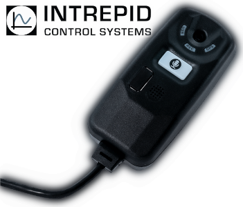

# neoVI MIC2 Application Programming Interfaces




[](https://crates.io/crates/neovi_mic)
[](https://docs.rs/neovi_mic/)
<!-- [](https://github.com/intrepidcs/neovi_mic/actions) -->

## **Description**

neoVI MIC 2 is a handheld pendant accessory with USB Trigger, GPS and microphone sold by Intrepid Control System, Inc. This repository brings an easy to use API for the following langauges:

- [Rust](https://www.rust-lang.org/)
- [Python](https://www.python.org)
- [C/C++](https://en.wikipedia.org/wiki/C_(programming_language)),
- [C#](https://en.wikipedia.org/wiki/C_Sharp_(programming_language))
- [JavaScript / Wasm](https://webassembly.org/)


### Features
- Internal microphone for audio annotations tied to trigger events
- Trigger button
- GPS Lock Indicator 
- USB Link Indicator
- Recording Active Indicator
- Buzzer

## **Getting Started**


### udev rules

neoVI MIC2 needs permission to access the IO portion of the device.
Copy [99-intrepidcs.rules](99-intrepidcs.rules) to `/etc/udev/rules.d`
```
cp 99-intrepidcs.rules /etc/udev/rules.d/
udevadm control --reload-rules && udevadm trigger
```

### **Rust**

`cargo add neovi_mic`

### **Python**

`pip install neovi_mic`


### **C/C++**

`TODO: cmake something?`


### **C#**

`TODO`


### **JavaScript / Wasm**

`TODO: Node?`


## **Links**

- [User Guide](https://cdn.intrepidcs.net/guides/neoVI-MIC2/)
- [Store Page](https://store.intrepidcs.com/product/neovi-mic-2)
- [Store Page (with GPS)](https://store.intrepidcs.com/product/neovi-mic-2-gps)


## **Development**

`neovi_mic` uses [Rust](https://www.rust-lang.org/) to build the APIs for all language bindings. See below for dependencies and other instructions for how to develop for `neovi_mic`

### **Dependencies**

- [Rust 1.69.0](https://www.rust-lang.org/)
- [libsfml 2.6.x](http://www.sfml-dev.org/)
- [libudev-dev](https://pkgs.org/search/?q=libudev-dev)
- [Python 3.7 - 3.10](http://python.org) (>=3.11 broken for WASM currently [See issue here](https://github.com/wasmerio/wasmer-python/issues/696))

##### Debian/Ubuntu
- ```sudo apt-get install libsfml-dev libudev-dev```

##### OpenSUSE

- ```sudo zypper install libsfml2-2_5 libudev-devel```

##### Fedora

- ```sudo dnf install SFML-devel systemd-devel```

##### Arch

- ```sudo pacman -S sfml # TODO: libudev-dev```

##### Windows

- [SFML Binaries](https://www.sfml-dev.org/download/sfml/2.6.0/)

##### macOS

- TODO

## **[LICENSE](LICENSE)**

```
The MIT License

Copyright (c) <Intrepid Control Systems, Inc.>

Permission is hereby granted, free of charge, to any person obtaining a copy
of this software and associated documentation files (the "Software"), to deal
in the Software without restriction, including without limitation the rights
to use, copy, modify, merge, publish, distribute, sublicense, and/or sell
copies of the Software, and to permit persons to whom the Software is
furnished to do so, subject to the following conditions:

The above copyright notice and this permission notice shall be included in all
copies or substantial portions of the Software.

THE SOFTWARE IS PROVIDED "AS IS", WITHOUT WARRANTY OF ANY KIND, EXPRESS OR
IMPLIED, INCLUDING BUT NOT LIMITED TO THE WARRANTIES OF MERCHANTABILITY,
FITNESS FOR A PARTICULAR PURPOSE AND NONINFRINGEMENT. IN NO EVENT SHALL THE
AUTHORS OR COPYRIGHT HOLDERS BE LIABLE FOR ANY CLAIM, DAMAGES OR OTHER
LIABILITY, WHETHER IN AN ACTION OF CONTRACT, TORT OR OTHERWISE, ARISING FROM,
OUT OF OR IN CONNECTION WITH THE SOFTWARE OR THE USE OR OTHER DEALINGS IN THE
SOFTWARE.
```